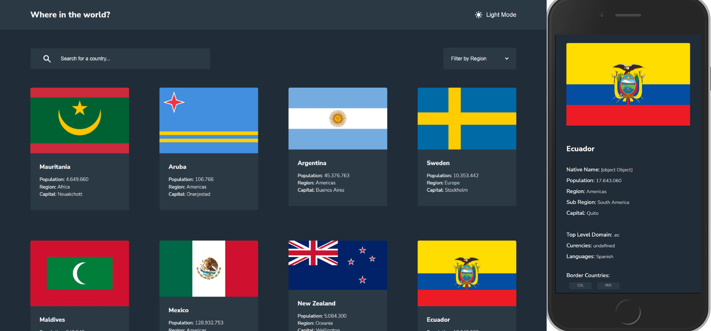

# Frontend Mentor - REST Countries API with color theme switcher solution

This is a solution to the [REST Countries API with color theme switcher challenge on Frontend Mentor](https://www.frontendmentor.io/challenges/rest-countries-api-with-color-theme-switcher-5cacc469fec04111f7b848ca). Frontend Mentor challenges help you improve your coding skills by building realistic projects. 

## Table of contents

- [Overview](#overview)
  - [The challenge](#the-challenge)
  - [Screenshot](#screenshot)
  - [Links](#links)
- [My process](#my-process)
  - [Built with](#built-with)
  - [What I learned](#what-i-learned)
  - [Continued development](#continued-development)
  - [Useful resources](#useful-resources)
- [Author](#author)

## Overview

### The challenge

Users should be able to:

- See all countries from the API on the homepage
- Search for a country using an `input` field
- Filter countries by region
- Click on a country to see more detailed information on a separate page
- Click through to the border countries on the detail page
- Toggle the color scheme between light and dark mode *(optional)*

### Screenshot



### Links

- Solution URL: [Solution CODE](https://github.com/SinisaVukmirovic/FrontEnd-Mentor-challenge-5)
- Live Site URL: [Live DEMO](https://sinisavukmirovic.github.io/FrontEnd-Mentor-challenge-5/)

## My process

### Built with

- Semantic HTML5 markup
- CSS custom properties
- Flexbox
- CSS Grid
- JavaScript
- REST API
- Mobile-first workflow

### What I learned

- Learned how to make number into 3 digits dot separated numbers (1.000.000) with RegEx
```js
function numberWithDots(numb) {
    return numb.toString().replace(/\B(?=(\d{3})+(?!\d))/g, ".");
}
```

- Learned how to open new page without using an a href='' anchor tag
```js
  window.open('../pages/detail.html', '_self');
``` 
##### _self option is for opening in the same window tab

### Continued development

Best way for Dark/Light theme functionality implementation on multi page site

### Useful resources

- [Open new page without using a href='' anchor tag](https://www.w3schools.com/jsref/met_win_open.asp) - Decided to open new page this way, to keep the MarkUp a little cleaned and not wrapping all cards in a link tag.

## Author

- Website - [Sinisa Vukmirovic](https://github.com/SinisaVukmirovic)
- Frontend Mentor - [@SinisaVukmirovic](https://www.frontendmentor.io/profile/SinisaVukmirovic)
- Twitter - [@sajtowski](https://twitter.com/sajtowski)